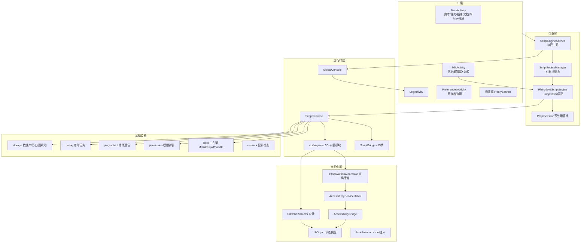
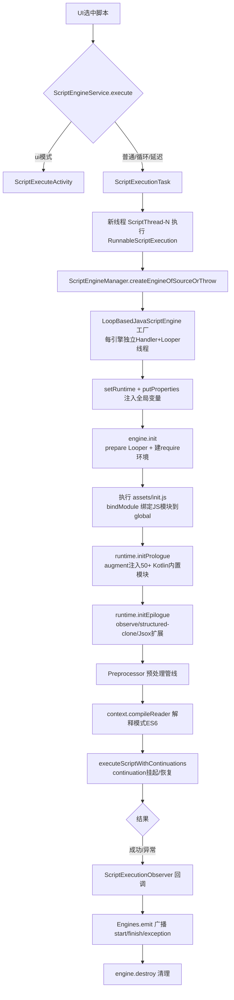
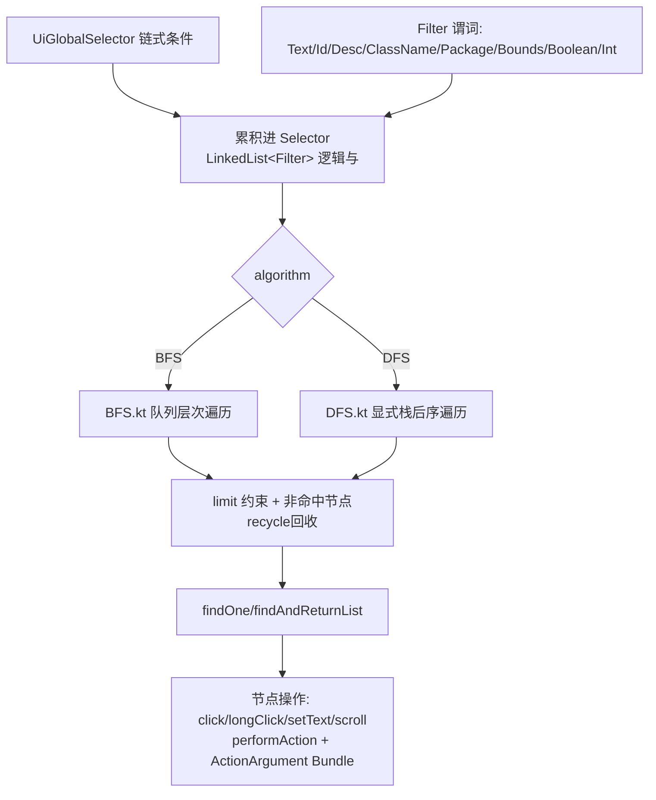

# AutoJs6 项目全面系统性分析报告

> 分析日期：2026-09-17
> 项目仓库：https://github.com/SuperMonster003/AutoJs6
> 当前版本：v6.7.0 (VERSION_BUILD=3804)
> 分析范围：基于本地仓库 `g:\code\autojs\source\AutoJs6` 源码全量分析

---

## 1. 项目概述

AutoJs6 是一款**基于 Rhino 引擎的 Android 无障碍自动化脚本应用**，源自 Auto.js（hyb1996 于 2017 年开发、2020 年停更的 4.1.1 Alpha2），由 SuperMonster003 于 2021/12/01 二次开发并持续维护至今（约 4.3 年，21 个版本迭代），保持开源免费。

**核心能力**：
- 通过 Android 无障碍服务执行 UI 自动化（点击、滑动、手势、文本输入、控件查找）
- 内置 Rhino (Mozilla) JavaScript 引擎执行 ES6 脚本
- 提供 50+ 内置模块 API（app/auto/ui/colors/images/ocr/device/http 等），v6.6.0 起由 Kotlin 声明式注入
- 支持脚本录制、定时任务、悬浮窗、终端、插件系统、双引擎 OCR（RapidOCR + PaddleOCR）、Shizuku 特权执行
- 多语言（10 种）、主题色、夜间模式、VSCode 远程调试

**规模指标**：主源码 1731 个 Java/Kotlin 文件，约 18 万行代码；assets 内含离线文档站、示例脚本库、OCR 模型。

---

## 2. 项目结构说明

```
AutoJs6/
├── app/                          # 主应用模块 (com.android.application)
│   ├── build.gradle.kts          # 29KB 构建脚本（flavor/依赖/打包策略）
│   ├── proguard-rules.pro        # R8 规则（isMinifyEnabled=false，规则仅为预留）
│   └── src/
│       ├── main/
│       │   ├── AndroidManifest.xml   # 33KB，四大组件与权限全量声明
│       │   ├── aidl/                 # IUserService.aidl（Shizuku 用户服务契约）
│       │   ├── assets/               # init.js、modules/、binary/、fonts/、web/
│       │   ├── assets-app/           # 离线文档 docs/、编辑器主题、js-beautify、indices 补全索引、sample 示例库
│       │   ├── assets-inrt/          # inrt 变体的示例项目与字体
│       │   ├── java/                 # 主源码（org.autojs.autojs 为主包）
│       │   ├── jniLibs/              # 原生库
│       │   └── res/                  # 资源
│       ├── debug/ release/ androidTest/
├── build-logic/                  # Gradle 组合构建（includeBuild）
│   ├── convention/               # 自定义插件：utils/versions/signs/properties/jvm-convention/local-arr-register
│   └── ksp-version-codes-processor/  # KSP 处理器：version-codes.csv → VersionCodesInfoGenerated.kt
├── modules/                      # 9 个第三方库源码移植（jieba、apk-signer、material-dialogs 等）
├── libs/                         # 15 个本地 AAR/JAR 注册库（opencv、rapidocr、markwon、终端等）
├── plugin-api/                   # 插件 API：paddle-ocr-api（AIDL 契约）+ paddle-ocr-engine（引擎实现）
├── gradle/
│   ├── libs.versions.toml        # 版本目录（99 版本 + 83 库）
│   ├── data/                     # 版本兼容数据表（agp/gradle-kotlin/java-gradle/ksp/android-studio 映射）
│   ├── wrapper/                  # Gradle 9.4.0
│   └── wrappers/ + gradle-wrapper-switcher*   # 多版本 wrapper 切换工具
├── .changelog/                   # 10 种语言变更日志 JSON
├── .readme/                      # README 母模板 + common.json + 10 语言文案 → 生成 11 份 README
├── .github/workflows/android.yml # CI：assembleInrtRelease + assembleAppRelease
├── .utils/                       # Node 爬虫/解析/注入脚本（版本数据自动化维护）
├── .python/                      # README/文档生成脚本
├── version.properties            # 版本事实源（VERSION_NAME/VERSION_BUILD/SDK/NDK 版本）
├── settings.gradle.kts           # 37KB，构建入口 + 版本自动选择引擎
└── build.gradle.kts / gradle.properties / README.md
```

### 2.1 主源码包结构（app/src/main/java）

| 包路径 | 职责 |
|---|---|
| `org.autojs.autojs` | 新主包（Kotlin 化核心），`App.kt`/`AutoJs.kt`/`AbstractAutoJs.kt` 为应用装配入口 |
| `org.autojs.autojs.engine` | 脚本引擎体系（ScriptEngineService/Manager/Factory、RhinoJavaScriptEngine、预处理 Preprocessor） |
| `org.autojs.autojs.rhino` | Rhino 定制（AndroidContextFactory、调试器 Debugger、TopLevelScope、Continuation） |
| `org.autojs.autojs.runtime` | 运行时（ScriptRuntime、ScriptBridges、`api/augment/` 下 50+ 内置模块声明式注入） |
| `org.autojs.autojs.core` | 核心设施（accessibility、automator、console、looper、pref、image、inputevent、record、ui/inflater） |
| `org.autojs.autojs.ui` | 全部界面（BaseActivity、MainActivity、EditActivity、日志/设置/悬浮窗/主题等） |
| `org.autojs.autojs.app` | 框架辅助类（GlobalAppContext、生命周期回调、工具） |
| `org.autojs.autojs.project/storage` | 工程模型（ProjectLauncher/Config）与存储（database/file/history） |
| `org.autojs.autojs.timing` | 定时任务体系（Alarm/Job/Work 三种调度器 + BootCompletedReceiver） |
| `org.autojs.autojs.pluginclient` | 插件客户端（JsonSocket 协议、Router、DevPluginService） |
| `org.autojs.autojs.permission` | 权限封装（Shizuku、AllFilesAccess、MediaProjection 等） |
| `com.stardust.autojs` | 历史主包（Auto.js 4.x 遗留，AutoJs.java/ScriptEngineService.java 等旧版实现参照） |
| `com.stardust.automator` | 无障碍节点对象模型与查找算法（UiObject/UiGlobalSelector/DFS/BFS/Filter） |
| `com.stardust.view` | 布局检查、无障碍辅助（AccessibilityNodeInfoAllocator 等） |
| `org.autojs.autojs.inrt` | inrt 变体专用（解密引擎等） |
| `org.mozilla/javascript` | Rhino 引擎部分源码就地定制（ContextWrapper 等） |
| `pxb/android/axml`、`zhao`、`ezy`、`pl` | 第三方源码内嵌（AXML 解析、aar 相关等） |

---

## 3. 构建与部署体系

### 3.1 构建入口与版本自动选择引擎

`settings.gradle.kts`（830 行）是整个构建体系的大脑，实现了业界少见的**"平台探测 → 版本自动匹配"引擎**：

1. **模块组织**：`includeBuild("build-logic")` 组合构建；通过 `modules`（9）/`libs`（15）/`plugin-api`（2）三组列表动态 include 并重定向 projectDir。
2. **版本覆盖机制**：`version.properties` 中 `OVERRIDDEN_JAVA_VERSION/AGP/KOTLIN/KSP` 四个键可强制指定版本（当前均为 NONE，走自动选择）。
3. **平台探测**：`config.platforms.determine()` 通过系统属性（`idea.version`、`idea.vendor`、`java.vendor` 等）识别 Android Studio / IntelliJ IDEA / Temurin / Unknown，按 weight 择优。
4. **版本解析**：`notations` 支持三类——`auto:`（按 gradle/data 兼容表匹配）、`toml:`（读 libs.versions.toml）、用户显式指定。AGP 结合 `agp-releases.list` 做发布版降级；Kotlin 按 Gradle 取最高兼容；KSP 按 Kotlin 版本映射。
5. **JDK 管理**：`org.gradle.toolchains.foojay-resolver-convention` 开启 JDK 自动下载，`java-gradle-compat.properties` 决定 Java↔Gradle 匹配。

**数据表文件**（`gradle/data/`）：`agp-releases.list`、`agp-gradle-compat`、`gradle-kotlin-compat`、`java-gradle-compat`、`ksp-releases`、`android-studio-*` 系列（AS build 号 ↔ 版本号 ↔ 代号映射）。这些表由 `.utils/` 下的 Node 爬虫脚本（`scrape-and-inject-*`）自动化维护。

### 3.2 关键构建参数

| 项目 | 值 |
|---|---|
| Gradle | 9.4.0 |
| JDK | 17 最低 / 21 建议 / 25 最高（当前 CI 用 21） |
| compileSdk / minSdk / targetSdk | 36 / 24 / 36 |
| inrt 变体 targetSdk | 29（兼容低版本模拟/设备） |
| AGP | 自动选择（兼容表匹配） |
| Kotlin | 自动选择（按 Gradle 版本兼容映射） |
| JVM 参数 | -Xms4g -Xmx4g |

### 3.3 flavor 与构建变体

- **dimension `channel`**：`app`（applicationId `org.autojs.autojs6`）与 `inrt`（applicationIdSuffix `.inrt`，targetSdk 29）。
- **ABI splits**：arm64-v8a / x86_64 / armeabi-v7a / x86 / armeabi 分 APK + universal；inrt 关闭 split。产物命名 `autojs-v6.7.0-arm64-v8a.apk`。
- **`appendDigestToReleasedFiles`**：发布前给 APK 追加 CRC32 摘要后缀（如 `-0f2a9d74`）。
- **版本自增**：`org.autojs.build.versions` 插件在 assemble 后距上次 `BUILD_TIME` 超 45 分钟自动回写递增 `VERSION_BUILD`。
- **签名**：读 `sign.properties`，无效则跳过（`isMinifyEnabled=false`，debug/release 共用签名）。

### 3.4 build-logic 自定义插件

| 插件 | 职责 |
|---|---|
| `org.autojs.build.utils` | CRC32 摘要、日期格式化、版本比较、`registerTemplateApkCopy`（inrt universal APK 拷入 assets-app/template.apk） |
| `org.autojs.build.versions` | 注入 SDK/版本常量；assemble 后自动递增 VERSION_BUILD |
| `org.autojs.build.signs` | 读取签名配置 |
| `org.autojs.build.properties` | `props` 扩展访问 version.properties |
| `org.autojs.build.jvm-convention` | 统一 Java/Kotlin 目标版本（toolchain/compileOptions/jvmTarget），AGP≥9 或 Gradle≥9 时跳过 kotlin-android 插件 |
| `org.autojs.build.local-arr-register-convention` | 注册本地 AAR |
| `ksp-version-codes-processor` | 生成 `VersionCodesInfoGenerated.kt`（Android 版本代号常量，供 `$versionCodes` 脚本 API 使用） |

### 3.5 CI/CD

仅 `.github/workflows/android.yml`：master push/PR 触发 → JDK 21 + 手动安装 CMake 3.10.2/Ninja → `assembleInrtRelease` + `assembleAppRelease` → 上传 arm64/armv7/universal 三个 APK artifact。

---

## 4. 核心功能模块划分与关系图



**模块交互要点**：
- UI 层不直接触碰引擎：脚本选中 → `ScriptEngineService.execute()` → 引擎/运行时/自动化三层协作。
- 运行时是中枢：内置模块（Augment）通过 `ScriptBridges` 与 JS 作用域双向通信，并持有自动化层、存储、定时任务等全部能力的引用。
- `com.stardust.autojs`（旧包）与 `org.autojs.autojs`（新包）存在职责重叠的镜像实现，新代码在 org 包演进。

---

## 5. 关键技术实现细节

### 5.1 脚本执行链路（核心算法流程）



**关键机制**：
- **Rhino 解释模式**：`AndroidContextFactory.isInterpretedMode=true`（不编译优化，利于指令级中断响应），`instructionObserverThreshold=10000` 结合 `InterruptibleAndroidContextFactory` 检测线程中断抛 `ScriptInterruptedException`，实现脚本强停。
- **Continuation 协程**：`LoopBasedJavaScriptEngine` 用每引擎 Looper 线程 + Rhino Continuation 实现 JS 协程（await/挂起），`executeScriptWithContinuations` 在挂起点捕获 `ContinuationPending` 并恢复。
- **模块加载**：`AssetAndUrlModuleSourceProvider`（支持 assets/URL/加密脚本）+ `RequireBuilder` + `SoftCachingModuleScriptProvider`；入口 `assets/init.js`，其返回值驱动 `bindModule()` 以字符串/数组/对象/函数四种形态注入全局。
- **ES6 支持**：`languageVersion=VERSION_ES6`，Rhino 2.0.0-SNAPSHOT。

### 5.2 无障碍服务与自动化

- **服务声明**：`AccessibilityServiceUsher` 继承 `android.accessibilityservice.AccessibilityService`，`canPerformGestures="true"`（dispatchGesture 前提）、`canRetrieveWindowContent`、`flagRetrieveInteractiveWindows` 等关键能力在 `res/xml/accessibility_service_config.xml` 配置。启动途径：root 写 secure settings / WRITE_SECURE_SETTINGS / `disableSelf` 三选一。
- **节点模型**：`UiObject` 直接继承 `AccessibilityNodeInfoCompat` 包装系统节点，持有 allocator/depth/indexInParent；`AccessibilityNodeInfoAllocator` 做节点回收复用（避免大量节点泄漏）。



- **全局手势**：坐标经 ScreenMetrics 缩放 → `GestureDescription.StrokeDescription` → `dispatchGesture(callback)`；同步版用 `VolatileDispose` + 自建 Looper 阻塞等待回调。click/press/longClick/swipe 均由 gesture 派生；back/home/recents 等走 `performGlobalAction`。
- **root 通道**：`RootAutomator`（assets/binary/root_automator）注入 /dev/input 触摸事件，与无障碍手势互为补充。
- **录制**：`GlobalActionRecorder` + `AccessibilityActionRecorder` 录制动作序列生成脚本。

### 5.3 内置模块与 API 注入机制（v6.6.0 架构变更）

**历史**：v6.6.0 前内置 API 以 JS 文件（`__app__.js` 等）存于 assets；v6.6.0 起全部 Kotlin 化，由**声明式注入框架**取代：

- `runtime/api/augment/Augmentable.kt`：声明 `selfAssignmentProperties/Functions/Getters` + `globalAssignment*` 列表，框架以 `BaseFunction`（`newBaseFunction`）`defineProp` 到全局作用域。
- 模块清单（约 50+）：app、autojs、automator、barcode、colors、console、device、dialogs、engines、events、files、floaty、global、http、images、media、notice、ocr、plugins、sensors、shell、shizuku、sqlite、storages、threads、timers、toast、ui、util、web、zip 等；键名双名制（如 `app` + `$app`）兼容旧脚本。
- **assets/modules 剩余 16 个 JS 文件**：第三方 JS 库（axios/dayjs/lodash/cheerio/banana-i18n/promise 等）+ 基础设施（jvm-npm 的 require、continuation、observe polyfill、ui-ext WebView 桥）。
- **注解**：`@ScriptInterface`/`@ScriptInterfaceCompatible`/`@ScriptVariable`/`@ScriptClass` 标记脚本 API（SOURCE 保留），`@RhinoFunctionBody`、`@AugmentableProxyInterface` 等支持运行时。

### 5.4 OCR 三引擎

| 引擎 | 实现 | 特点 |
|---|---|---|
| MLKit | `Ocr.kt` + MLKit OCR | Google 官方，条码+OCR |
| RapidOCR | `OcrRapid.kt` + `libs/rapidocr` | OnnxRuntime + opencv-mobile，CMake 原生，模型入 assets |
| PaddleOCR | `OcrPaddle.kt` + PaddleOcrEmbeddedEngine / 插件式 | 嵌入式选 v5/v3 模型变体；插件式经 `plugin-api/paddle-ocr-engine`（AIDL 契约 DTO） |

### 5.5 插件系统（双通道）

- **开发插件通道**（VSCode 远程）：`pluginclient/JsonSocket` TCP 分帧协议（8 字节头：长度+类型，JSON=1/BYTES=2），握手 `sayHello` → `sendCommand`；`Router` 按 key 路由；`DevPluginService` 监听 6347/7347 端口，支持远程项目解压执行。VSCode 端配合 AutoJs6-VSCode-Extension（当前要求 v1.0.13）。
- **OCR/能力插件通道**：plugin-api 模块，AIDL 契约 + 引擎实现分离。

### 5.6 定时任务

`TimedTaskManager` + 三种调度器：`AlarmTimedTaskScheduler`（AlarmManager 精确闹钟）、`JobTimedTaskScheduler`（JobScheduler 省电）、`WorkTimedTaskScheduler`（WorkManager 可靠）；`BootCompletedReceiver` 开机恢复。存储基于 Room（`TimedTaskDatabase`、`IntentTaskDatabase`，v6.7.0 新增 Intent 任务）。

### 5.7 存储体系

- 文件抽象双层：`pio/PFile` 系列（路径/IO 抽象）+ `io/EFile`（增强文件）。
- 数据库：Room（历史记录 HistoryDatabase、定时任务库）+ 旧式 `database/Database.java`/`BaseModel.java`。
- v6.7.0 新增：文件历史版本（HistoryRepository/TrashRepository/TrashBlobStore）、回收站。

---

## 6. API 接口规范

### 6.1 脚本 API 规范（JS 侧）

- 模块键名命名：小写单词（app、ui、colors、images…），同时暴露 `$` 前缀兼容名（`$app`）。
- 类方法映射：Kotlin 方法经 `newBaseFunction` 转 `BaseFunction`；`selfAssignmentProperties` 支持属性读/写；getter/setter 经 `Getters` 声明。
- 返回值规范：`result-adapter.js` 提供结果适配（Promise 化兼容）；`ScriptBridges` 统一 `call/asArray/toString`。
- 执行模式：脚本首 300 token 经 `TokenStream` 解析识别 `"ui;"`（UI 模式）/普通模式/循环/延迟模式（`RunnableScriptExecution` 的 delay/loopTimes/interval）。
- 全局常量：`$versionCodes`（KSP 处理器生成）、`$buildTime` 等。

### 6.2 平台 API（AIDL）

- `IUserService.aidl`：`execCommand`、`currentPackage/currentActivity/currentComponent(Short)`、`exit/destroy`——Shizuku 特权服务契约。
- `plugin-api/paddle-ocr-api`：OCR 选项/结果 DTO 契约。

### 6.3 插件通信协议

JsonSocket 帧协议：8 字节头（4 长度 + 4 类型）+ 载荷；类型 JSON=1 / BYTES=2；握手携带 device_name/app_version/device_id；命令类型含 TYPE_COMMAND 等。

---

## 7. 代码风格与规范

1. **注释规范**（作者 SuperMonster003 特色）：
   - `@Hint by <作者> on <日期>` 标记设计意图说明（含 `!` 前缀续行与 `zh-CN:` 中文释义）。
   - `@Legacy` 标记废弃实现；`@Deprecated("Deprecated since vX.X", ReplaceWith(...))` 带迁移指引。
   - `// @FIXME` 记录已知问题（如 log4j 漏洞）。
   - 行内 `$` 前缀 Kotlin 模板与可读性优先的换行风格。
2. **语言**：Kotlin 为主（新代码），Java 为辅（历史/第三方移植），两者混合共存。
3. **包组织**：新逻辑入 `org.autojs.autojs`，旧版参照留在 `com.stardust`。
4. **构建风格**：根 `build.gradle.kts` 极简，逻辑下沉到 build-logic 组合构建；`settings.gradle.kts` 承担版本引擎。
5. **版本化提交**：`version.properties` 为唯一事实源，`BUILD_TIME` 防频繁自增；发布流程有严格 checklist（见 README 末尾注释）。
6. **文档即代码**：.changelog/.readme 多语言 JSON + 模板生成；`.utils` 爬虫自动维护版本兼容表。
7. **Suppress 习惯**：文件头 `@file:Suppress("SpellCheckingInspection")`，大量 `@Suppress("UNCHECKED_CAST")` 等（对 lint 较宽容，lint abortOnError=false）。

---

## 8. 第三方依赖库及版本

### 8.1 关键 Maven 依赖（app 模块）

| 依赖 | 版本 | 用途 |
|---|---|---|
| Rhino | 2.0.0-SNAPSHOT | JS 引擎 |
| AndroidX Core KTX / Activity KTX | - | 基础 |
| Material Components | - | UI |
| Retrofit + Gson + RxJava2 adapter | 3.0.0 | 网络 |
| OkHttp | 4.12.0 | HTTP 客户端 |
| Glide + KSP | 5.0.5 | 图片加载 |
| Room + KSP | 2.8.1 | 数据库 |
| LeakCanary | - | 内存泄漏检测（debug） |
| Shizuku | 13.1.5 | 特权执行 |
| JavaMail | - | 邮件 |
| Paho MQTT | - | MQTT |
| ICU4J / OpenCC / Pinyin4j | - | 国际化/简繁/拼音 |
| MLKit OCR / 条码 | - | OCR |
| Jsoup / Joda Time / Zip4j / CommonMark | - | HTML/时间/压缩/Markdown |
| R8 | 8.13.17 | 混淆规则（未启用） |
| Desugar | 2.1.5 | Java 8+ API 脱糖 |

### 8.2 本地集成库（libs/）

- `jackpal-androidterm` 三件套（1.0.70/1.0.42/1.0）：终端模拟器
- `markwon-core` + `markwon-syntax-highlight`（4.6.2）：Markdown 渲染 + Prism4J 高亮
- `rapidocr`：RapidAI OCR（OnnxRuntime + opencv-mobile，CMake）
- `imagequant`：libimagequant + libpng NDK 封装
- `org-opencv-4_8_0`：OpenCV
- `android-spackle`、`android-assertion`、`android-plugin-client-sdk-for-locale`（9.0.0）、`root-shell`（1.6）、`android-job-simplified`、`androidx-appcompat`、`apk-parser`、`javamail-android`
- 顶层 jar：`rhino`、`com-android-dx`、`github-api`、`mime-util`、`prism4j`、`tiny-sign`

### 8.3 源码移植模块（modules/）

jieba-analysis（结巴分词）、apk-signer（com.mcal）、apk-parser（net.dongliu）、color-picker（jaredrummler）、material-dialogs（afollestad）、material-date-time-picker（wdullaer）、expandable-layout（aakira）、expandable-recyclerview（bignerdranch）、recyclerview-flexibledivider（yqritc）。

### 8.4 原生工具链

OpenCV 4.8.0 / PaddleOCR（NDK 21.1 + CMake 3.10.2）/ RapidOCR（NDK 23.1 + CMake 3.22.1 + OnnxRuntime 1.14.0）/ ImageQuant（NDK 26.1 + CMake 3.22.1）。

---

## 9. 历史版本变更记录（最近 8 个版本）

| 版本 | 日期 | 核心更新 |
|---|---|---|
| **v6.7.0** | 2026/03/14 | 插件中心、文件历史版本、回收站、Paddle OCR 插件；新增 cvt/fmt/zip/mediainfo 模块；http 异步请求与缓存；定时任务调度引擎设置；Rhino 2.0.0-SNAPSHOT；适配 Gradle 9 |
| v6.6.4 | 2025/05/31 | util 像素单位转换、状态栏 API 更名、Android 15 修复 |
| v6.6.3 | 2025/05/27 | 发行历史功能、timers.keepAlive、engines 事件监听、全分辨率找图、WebView JsBridge |
| v6.6.2 | 2025/04/16 | ui 状态栏/导航栏 API、images.flip、主题色页面重构、恢复 com.stardust 前缀兼容 |
| v6.6.1 | 2025/01/01 | pinyin/pinyin4j 模块、UiObject#isSimilar、打包签名配置 |
| v6.6.0 | 2024/12/02 | **内置模块 Kotlin 重写（警告谨慎升级）**、axios/cheerio/sqlite/mime/nanoid 模块、Rapid OCR、双开应用 |
| v6.5.0 | 2023/12/02 | opencc 模块、打包 ABI 筛选 |
| v6.4.2 | 2023/11/15 | dialogs.build inputSingleLine、console.setTouchable、ocr 区域修复 |

**迭代跨度**：v6.0.0（2021/12/01）→ v6.7.0（2026/03/14），共 21 个版本，约 4.3 年。v6.0.0 起始内容即包含 Rhino 1.7.7.2→1.7.13 升级、OpenCV 3.4.3→4.5.4、移除社区页、JCenter→Maven Central。

**变更日志数据结构**（`.changelog/lang_zh-Hans.json`）：`$data` → 版本号 → `released_date` + 可选 `hint/feature/fix/improvement/dependency` 字符串数组。

---

## 10. 潜在优化点与技术债务

### 10.1 已明确标记的问题（源码 FIXME）

1. **log4j 1.x 漏洞**（`app/build.gradle.kts` FIXME）：5 个高危 CVE（CVE-2022-23307 等，最高 9.8 分），随 `com-android-dx`/`github-api` 等传递引入，需升级或排除。
2. **`isMinifyEnabled=false`**（debug+release 均未开启混淆）：proguard 规则 5.5KB 形同虚设，发布包无代码混淆/裁剪，存在逆向风险与包体优化空间。

### 10.2 架构性债务

3. **新旧双包镜像**：`com.stardust.autojs`（旧）与 `org.autojs.autojs`（新）存在大量职责重叠的平行实现（AutoJs.java vs AutoJs.kt、ScriptRuntime.java vs ScriptRuntime.kt、双份 engine/runtime/execution 包），维护成本高，存在逐步迁移清理空间。
4. **双文件抽象**：`pio/PFile` 与 `io/EFile` 双层抽象边界模糊，调用链较长。
5. **Rhino 2.0.0-SNAPSHOT**：依赖快照版（非稳定发布），存在 API 漂移风险；同时 `org/mozilla/javascript/` 源码就地定制（ContextWrapper 等），与上游升级冲突。
6. **JSON 多语言维护成本**：.changelog/.readme 各 10 语言 JSON 手工/脚本同步，漏译风险（v6.7.0 的 hint 字段部分语言缺失）。

### 10.3 工程与质量

7. **测试几乎空白**：androidTest 仅 1 个文件，核心算法（DFS/BFS 查找、TokenStream 解析、版本匹配引擎）无单元测试，回归风险高。
8. **assets 冗余**：`assets-app/docs/` 离线文档站（数 MB）+ `indices/all_android_classes.json`（5MB）打进 APK，可通过按需下载瘦身。
9. **废弃目录**：`assets/modules/obsolete/`（idea 中已 exclude）与旧版 JS 模块残留未清理。
10. **版本兼容表自动化依赖**：gradle/data 数据表依赖 .utils 爬虫手动执行维护，若爬取失败可能导致构建版本解析错误。
11. **`lint abortOnError=false`** + 大量 `@Suppress`：静态检查约束弱。
12. **AIDL/Shizuku 服务**：`IUserService` 无版本化演进策略，跨版本兼容风险。

---

## 11. 文档与多语言体系

- **README 生成**：`.readme/template_readme.md` 母模板（`{{ 占位符 }}`）+ `common.json`（共享动态数据）+ 10 语言 `lang_*.json` → `.python/generate_markdown.py` 生成 11 份 README（根 README.md = 简体中文）。
- **README 章节**：语言 → 简介 → 功能 → 环境 → 指南 → 主要变更 → 发行历史 → 项目编译构建（8 子节）→ **脚本开发辅助**（`#script-development-assistance`，含 VSCode 插件、TypeScript 声明、应用文档、参考脚本项目）→ 贡献参与。
- **变更日志**：`.changelog/` 10 语言 JSON，发布前更新并同步 TypeScript 声明。
- **离线应用文档**：`assets-app/docs/`（HTML 静态站，经 .python 文档生成脚本）。
- **发布流程**（README 内嵌 checklist）：更新 changelog → 重生成 README/文档 → 检查 VSCode 扩展双版本 → `assembleInrtRelease` → `appendDigestToReleasedFiles` → 提交发布带签名 APK。

---

## 12. 附录：关键文件索引

| 关注点 | 路径 |
|---|---|
| 构建入口/版本引擎 | `settings.gradle.kts` |
| 版本事实源 | `version.properties` |
| 依赖版本目录 | `gradle/libs.versions.toml` |
| 主模块构建 | `app/build.gradle.kts` |
| 自定义插件 | `build-logic/convention/src/main/kotlin/org/autojs/build/*.kt` |
| 应用装配入口 | `app/src/main/java/org/autojs/autojs/AbstractAutoJs.kt`、`App.kt`、`AutoJs.kt` |
| 引擎核心 | `app/src/main/java/org/autojs/autojs/engine/RhinoJavaScriptEngine.kt` |
| 运行时/模块注入 | `app/src/main/java/org/autojs/autojs/runtime/ScriptRuntime.kt`、`runtime/api/augment/` |
| Rhino 定制 | `app/src/main/java/org/autojs/autojs/rhino/AndroidContextFactory.kt` |
| 无障碍服务 | `app/src/main/java/org/autojs/autojs/core/accessibility/AccessibilityService.kt`、`res/xml/accessibility_service_config.xml` |
| 节点查找算法 | `app/src/main/java/com/stardust/automator/{search/DFS.kt,search/BFS.kt,filter/Selector.kt}` |
| 全局手势 | `app/src/main/java/com/stardust/automator/GlobalActionAutomator.kt` |
| 主界面 | `app/src/main/java/org/autojs/autojs/ui/main/MainActivity.kt` |
| 编辑器 | `app/src/main/java/org/autojs/autojs/ui/edit/EditActivity.kt` |
| 插件协议 | `app/src/main/java/org/autojs/autojs/pluginclient/JsonSocket.java` |
| OCR 入口 | `app/src/main/java/org/autojs/autojs/runtime/api/augment/ocr/Ocr.kt` |
| 定时任务 | `app/src/main/java/org/autojs/autojs/timing/` |
| 模块加载入口 | `app/src/main/assets/init.js`、`app/src/main/assets/modules/jvm-npm.js` |
| CI | `.github/workflows/android.yml` |
| 变更日志 | `.changelog/lang_zh-Hans.json` |
| 脚本开发辅助章节 | `README.md#L622-L648` |
